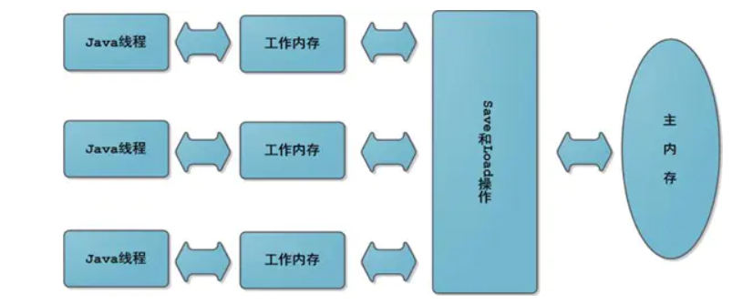

# 多线程

## 一、volatile

```
1、可见性
2、不保证原子性
3、禁止进行指令重排序
```

```java
class Data{

    volatile Integer number = 0;// 非原子性

    volatile AtomicInteger atomicNumber = new AtomicInteger(0); // 原子性AtomicInteger

    public void addPlus(){
        number ++;
    }

    public void atomicAddPlus(){
        atomicNumber.getAndIncrement();
    }
}


private static void atomic() {
    Data data = new Data();
    for (int i = 0; i < 10; i++) {
        new Thread(()->{
            for (int j = 0; j < 2000; j++) {
                data.addPlus();// 不保证原子性
                data.atomicAddPlus();
            }
        },String.valueOf(i)).start();
    }
    while (Thread.activeCount() > 2){

    }
    System.out.println(Thread.currentThread().toString() + " : atomic " + data.atomicNumber.get());
    System.out.println(Thread.currentThread().toString() + " : " + data.number);
}
Connected to the target VM, address: '127.0.0.1:61482', transport: 'socket'
Thread[main,5,main] : atomic 20000
Thread[main,5,main] : 8577
Disconnected from the target VM, address: '127.0.0.1:61482', transport: 'socke'

Process finished with exit code 0
```



## 二、JMM

```
1、可见性  保证多个线程 在某一个线程对 主内存的数据操作 对其他线程可见 
2、原子性  确保多个线程 在某一个有且仅有一个线程 对数据操作
3、有序性  cpu执行的指令 是有序的
```

